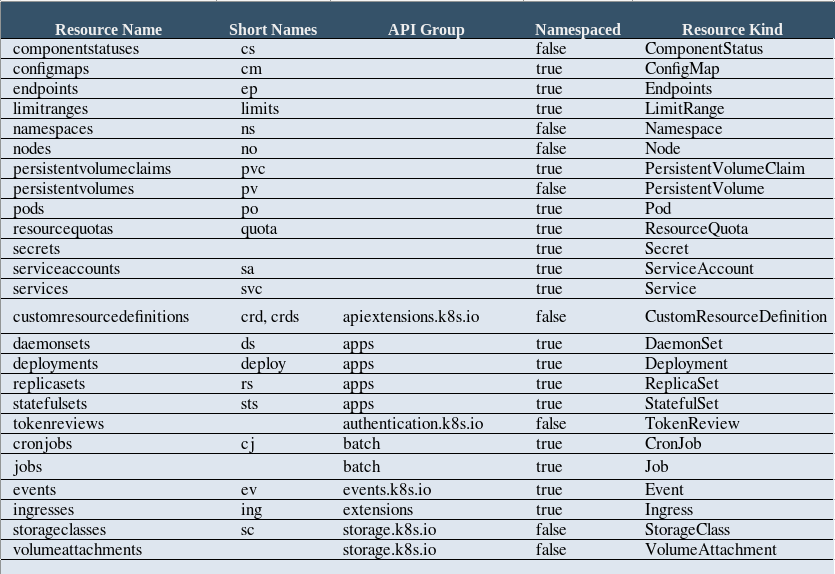

# Install, Setup and Overview kubectl
## Install kubectl on Linux
#### Install kubectl binary with curl on Linux
1. Download the latest release with the command, for example, to download version v1.18.0 on Linux, type:
```bash
curl -LO https://storage.googleapis.com/kubernetes-release/release/v1.18.0/bin/linux/amd64/kubectl
```
2. Make the kubectl binary executable.
```bash
chmod +x ./kubectl
```
3. Move the binary in to your PATH.
```bash
sudo mv ./kubectl /usr/local/bin/kubectl
```
4. Test to ensure the version you installed is up-to-date:
```bash
kubectl version --client
```
#### OR Install it using native package management
```bash
sudo apt-get update && sudo apt-get install -y apt-transport-https gnupg2
curl -s https://packages.cloud.google.com/apt/doc/apt-key.gpg | sudo apt-key add -
echo "deb https://apt.kubernetes.io/ kubernetes-xenial main" | sudo tee -a /etc/apt/sources.list.d/kubernetes.list
sudo apt-get update
sudo apt-get install -y kubectl
```

## Setup kubectl on Linux
#### Verifying kubectl configuration
  - In order for kubectl to find and access a Kubernetes cluster, it needs a kubeconfig file, which is created automatically when you create a cluster using  a [Kind](https://github.com/genral73/k8s-kind) or [Minikube](https://github.com/genral73/k8s-minikube) clusters.
  - By default, kubectl configuration is located at ~/.kube/config.

1. Check that kubectl is properly configured by getting the cluster state:
```bash
kubectl cluster-info
```
- If you see a message similar to the following, kubectl is not configured correctly or is not able to connect to a Kubernetes cluster.

>   output: The connection to the server <server-name:port> was refused - did you specify the right host or port?
<hr/>

#### Enabling shell autocompletion
##### The completion script depends on bash-completion, which means that you have to install this software first:
1. Install bash-completion
```bash
apt-get install bash-completion
```
2. if the command succeeds, you’re already set, otherwise add the following to your ~/.bashrc file:
```
source /usr/share/bash-completion/bash_completion
```
3. Reload your shell and verify that bash-completion is correctly installed by typing type:
```bash
type _init_completion
```

##### You now need to ensure that the kubectl completion script gets sourced in all your shell sessions:
1. Source the completion script in your ~/.bashrc file:
```bash
echo 'source <(kubectl completion bash)' >>~/.bashrc
```
2. If you have an alias for kubectl, you can extend shell completion to work with that alias:
```bash
echo 'alias k=kubectl' >>~/.bashrc
echo 'complete -F __start_kubectl k' >>~/.bashrc
```

<hr/>

## Overview of kubectl
This overview covers kubectl syntax, describes the command operations, and provides common example.
For installation instructions see [installing kubectl](https://github.com/genral73/k8s-cli#install-kubectl-on-linux).
- Syntax
- Operations
- Resource types
- Output options
- Examples: Common operations

#### Syntax
1. Use the following syntax to run kubectl commands from your terminal window:
```bash
kubectl [command] [TYPE] [NAME] [flags]
```
where `command`, `TYPE`, `NAME`, and `flags` are:
- command: Specifies the operation that you want to perform on resources, for example `create`, `get`, `describe`, `delete`.
- TYPE: Specifies the resource type, and it are case-insensitive, for exmaple `pods`, `configmaps`, `services`, `nodes`.
- NAME: Specifies the name of the resource, and it are case-sensitive, for exmaple `my-nginx-pod`, `dev-apache-pod`.
- flags: Specifies optional flags. For example, you can use the -s or --server flags to specify the address and port of the Kubernetes API serve
> If you need help, just run kubectl help from the terminal window.


#### The following is the most popular Operations:

- Remember: For more about command operations, see the [kubectl](https://kubernetes.io/docs/user-guide/kubectl) reference documentation.
<hr/>


#### The following is the most popular Resource types:

- Remember: For more about command operations, see the [kubectl](https://kubernetes.io/docs/user-guide/kubectl) reference documentation.
<hr/>

#### Output Formatting options
Use the following sections for information about how you can format or sort the output of certain commands.
The default output format for all kubectl commands is the human readable plain-text format, you can add either the -o or --output flags like:
```bash
kubectl [command] [TYPE] [NAME] -o <output_format>
```
Examples:
```bash
kubectl get pod web-pod-13je7 -o yaml
kubectl get pod web-pod-13je7 -o custom-columns=NAME:.metadata.name,RSRC:.metadata.resourceVersion
kubectl get pod web-pod-13je7 -o yaml 
kubectl get pods --sort-by=.metadata.name
```
<hr/>

#### What's next
Start using the [kubectl] commands.
